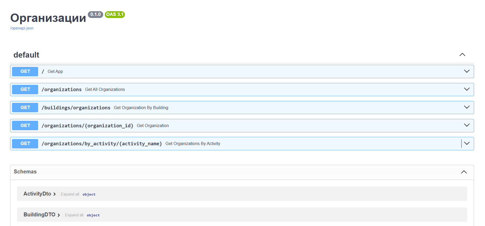

# Справочник Организаций, Зданий и Деятельности

Это приложение предоставляет REST API для справочника организаций, зданий и видов деятельности. API поддерживает поиск и
фильтрацию организаций по различным критериям, таким как здание, вид деятельности и название.

## Стэк технологий

- **FastAPI** — для создания API
- **SQLAlchemy** — для работы с базой данных
- **Alembic** — для миграций базы данных
- **Docker** — для упаковки приложения

## Запуск приложения через Docker

### Шаги для запуска:

1. **Склонируйте репозиторий**:
   ```bash
   git clone <https://github.com/VehsagriX/task_organization.git>
   cd <папка с проектом>

2. **Построение Docker-образа: Выполните команду для сборки Docker-образа:**

```bash
    docker build -t organizations-api .
```

3. **Запуск контейнера: После успешной сборки образа, запустите контейнер:**

```bash
    docker run -d -p 8000:8000 organizations-api
```

4. **Проверка работы API: Откройте браузер и перейдите по следующему адресу:**

```bash
   http://localhost:8000/docs
```
**Скриншоты документации API**


